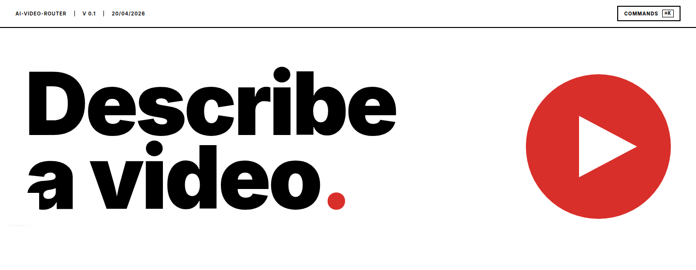

# ai-video-router

**Describe a video.** Get the right code-based video library, scaffolded, editable in chat.


---

A local, single-user Next.js app. Groq Llama 4 Scout picks one of seven video libraries from your prompt, the scaffolder stamps a starter project under `~/.ai-video-router/projects/<id>/`, and a sandboxed Claude Code session iterates inside it. The preview pane iframes the library's own dev server; the render pane streams progress from the library's native renderer to an MP4.

---

## 01 — Libraries

| Library          | Paradigm              | Good for                       |
| ---------------- | --------------------- | ------------------------------ |
| Remotion         | React components      | Explainers, kinetic typography |
| Hyperframes      | HTML/CSS templates    | Avatar & marketing             |
| Motion Canvas    | TypeScript generators | Animated diagrams              |
| Revideo          | TS generators (fork)  | Server-rendered animations     |
| Diffusion Studio | Browser-native TS     | Realtime preview               |
| Editly           | JSON-declarative Node | Simple cuts & montages         |
| FFCreator        | Canvas + ffmpeg       | Canvas-heavy compositions      |

---

## 02 — Quickstart

```sh
pnpm install
cp .env.example .env.local    # then fill in GROQ_API_KEY
pnpm run doctor               # verify Node/pnpm/ffmpeg/Chromium/claude
pnpm dev
```

Open `http://localhost:3000`, describe your video. The router classifies, the scaffolder installs, and the workspace opens with chat + preview + render.

---

## 03 — Prerequisites

- Node ≥ 20
- `pnpm` on `PATH`
- `ffmpeg` on `PATH` (for MP4 export)
- Chrome / Chromium (for Remotion, Diffusion Studio, FFCreator)
- A working `claude` CLI login on the same machine (the editing session inherits your auth)
- A Groq API key — [console.groq.com](https://console.groq.com)

Run `pnpm run doctor` to verify all of the above at once.

---

## 04 — How it works

```
             User prompt
                  ↓
   ┌──────────────────────────────┐
   │  Groq Llama 4 Scout          │   few-shot router, strict JSON schema
   └──────────────────────────────┘
                  ↓
       { library, paradigm, spec }
                  ↓
   ┌──────────────────────────────┐
   │  Scaffolder                  │   stamps ~/.ai-video-router/projects/<id>/
   └──────────────────────────────┘
                  ↓
   ┌──────────────────────────────┐
   │  Claude Agent SDK            │   sandboxed: path-scoped R/E/W, Bash deny-list
   └──────────────────────────────┘
                  ↓
      ┌────────────┴────────────┐
      ↓                         ↓
   Preview iframe        Render stream
   (library's own        (native renderer
    dev server)           → MP4 + thumbnail)
```

---

## 05 — Layout

```
app/                       Next.js App Router (UI + API routes)
  api/router/              POST: Groq Llama 4 classification
  api/projects/[id]        project CRUD
  api/session/[id]         SSE: Claude Code chat
  api/preview/[id]         start/stop/status for library dev server
  api/render/[id]          SSE: library native renderer
  api/renders/[id]/file    MP4 download
components/                React UI — chat, preview, render, landing
lib/
  drivers/                 VideoDriver impls — one file per library
  router/                  Groq Llama 4 classifier + prompt
  sessions/                Claude Agent SDK wrapper
  scaffolder/              template stamper
  preview/                 in-memory preview handle registry
  queries/                 typed SQLite queries
templates/                 starter projects per library
scripts/
  doctor.ts                pnpm run doctor
```

---

## 06 — Design

Swiss International Typographic Style. White ground, true black rules, single vermilion `#d92f2a` accent. Inter variable font for body and display. 2px ink rules for strong structural breaks, 1px soft grey elsewhere. No greys in type — size and weight carry hierarchy.

The brand mark is a red circle with a white play triangle: the app produces videos, nothing else needs saying.

---

## 07 — Status

**v0.1** — usable end-to-end for Remotion and Hyperframes. The other five libraries are scaffolded and routeable; render coverage is library-dependent (see in-app status).

---

## 08 — Auth & ToS

This app is explicitly **local, single-user**. It uses your own Claude Code auth from `~/.claude/`. Hosting it to serve other users with your credentials would violate Anthropic's ToS — for a multi-user deployment, swap to BYO or proxied API keys.

---

## License

Private / unreleased.
